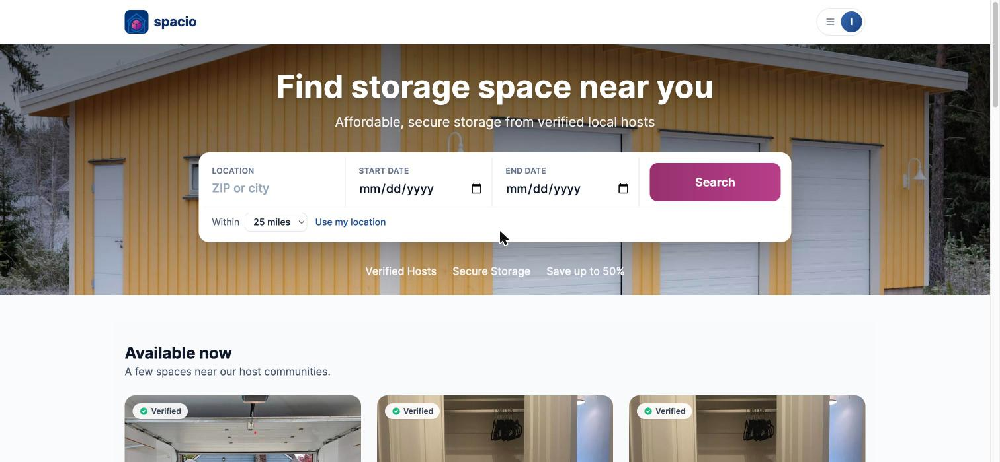

<div align="center">
  

  # Spacio

  **[spacio.cc](https://spacio.cc)**

  
</div>

Spacio is a peer-to-peer storage marketplace, "Airbnb for storage." People with
unused space (garages, closets, spare bedrooms, basements) list it. People who
need storage rent part of it, for the dates they need, paying only for the
square footage they actually use.

If you would like to understand the thought process I put for Spacio's
product thesis, business rules, engineering decisions, you can view them in
docs/DOCUMENTATION.MD. This truly encapulsates the logic I put into a product
of why something works, not just how it runs.

## Monorepo structure

```
spacio/
  api/          FastAPI backend (Python, MongoDB via Motor)
  web/          React + Vite + TypeScript frontend
  ml/           Pricing model: training, evaluation, artifacts (see ml/README.md)
  docs/         DOCUMENTATION.md and deep-dives
  .github/      CI workflows
  docker-compose.yml
```

## Status

All six planned phases are done and live at [spacio.cc](https://spacio.cc).
See [`docs/DOCUMENTATION.md` §11](docs/DOCUMENTATION.md#11-known-limitations--next-steps)
for the honest limitations list — nothing in this README claims more than
what's actually implemented.

Built: cookie-based JWT auth; listings CRUD with pro-rated, capacity-enforced
bookings (a listing supports multiple concurrent renters as long as
overlapping reservations never exceed its total square footage); a 24-hour
reservation hold that expires via a background sweep; reservation-scoped
messaging; Stripe Identity host verification (selfie match); Stripe Checkout
with manual-capture authorize/capture/cancel; Stripe Connect host payouts;
tiered renter cancellation refunds; a review system; a real LightGBM pricing
model; sentence-transformer semantic search ("Smart Match"); ZIP-centroid
radius search over a vendored Census gazetteer with a Leaflet map and a
listings-based city/neighborhood typeahead; S3-backed listing photos; a
landing page with featured listings, value-prop, host, and trust sections; a
full renter dashboard; CI for both halves; and a from-scratch EC2 deployment
(nginx, real TLS, an IAM instance role for S3) documented end-to-end in
[`deploy/DEPLOY.md`](deploy/DEPLOY.md).

## Local development

### Prerequisites

- Docker and Docker Compose (recommended, brings up Mongo, API, and web with
  one command), **or** Python 3.11+, Node.js 20+, and a local MongoDB instance
  if you'd rather run services natively.

### Quickstart (Docker)

```bash
git clone <this-repo-url> spacio
cd spacio
cp api/env.example api/.env   # fill in Stripe test keys if you have them; safe to leave blank otherwise
docker compose up --build
```

- API: http://localhost:8000 (docs at http://localhost:8000/docs)
- Web: http://localhost:5173

Seed demo data (in a second terminal, once the stack is up):

```bash
docker compose exec api python seed.py
```

### Demo accounts

After seeding:

- Host: `host@spacio.dev` / `password123`
- Renter: `renter@spacio.dev` / `password123`

### Running without Docker

```bash
# API
cd api
python -m venv .venv && source .venv/bin/activate
pip install -r requirements.txt -r requirements-dev.txt
cp env.example .env   # edit as needed; a local MongoDB must be running
uvicorn main:app --reload

# Web (separate terminal)
cd web
npm install
VITE_API_URL=http://127.0.0.1:8000 npm run dev
```

### Running tests

```bash
cd api && pytest
cd web && npm test
```

## License

MIT, see [`LICENSE`](LICENSE).
