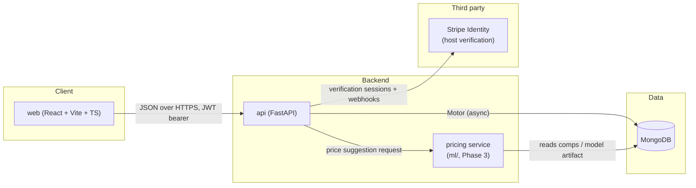
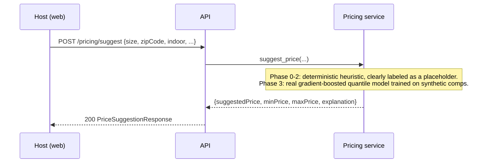
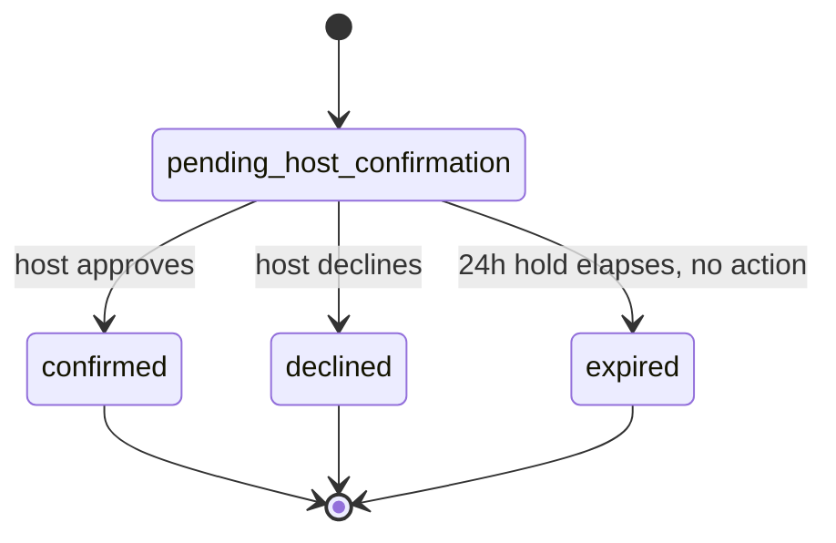

# Spacio — Engineering Documentation

This is a living engineering log and decision record. It is updated in the
same commit as any change it describes — if you find a stale section, that's
a bug, not a style choice.

## 1. Overview

Spacio is a peer-to-peer storage marketplace: people with unused space
(garages, closets, spare bedrooms) list it, and people who need storage rent
exactly the square footage they need, for exactly the dates they need it,
from a verified host nearby. See the [README](../README.md) for setup and
project structure. The full business thesis and customer research are
summarized in the decision log (§10) where they first became relevant to a
technical choice.

## 2. Architecture



### Request flow: creating a booking

```mermaid
sequenceDiagram
    participant R as Renter (web)
    participant A as API
    participant M as MongoDB

    R->>A: POST /reservations {listingId, sqftRequested, startDate, endDate, ...}
    A->>M: find listing by id
    A->>M: find overlapping reservations (status in [pending, confirmed])
    A->>A: sum reserved sqft; check sqftRequested <= totalSqft - reserved
    A->>A: calculate cost (base + service fee + box + insurance)
    A->>M: insert reservation (status=pending_host_confirmation, holdExpiresAt=+24h)
    A-->>R: 201 ReservationPublic
    Note over A,M: Host later calls POST /reservations/{id}/approve or /decline.<br/>No action within 24h -> expired (scheduled job, Phase 4).
```

### Request flow: price suggestion (host creating a listing)



## 3. Tech stack decisions

### FastAPI

**What:** Python async web framework for the `api/` service.
**Why:** Native async support pairs naturally with Motor's async MongoDB
driver, so a slow database call doesn't block the event loop. Pydantic
integration gives us request/response validation and OpenAPI docs for free,
which matters when the frontend and ML service both consume this API.
**Alternatives considered:** Django REST Framework — more batteries included
(admin, ORM), but the ORM assumes a relational model we're deliberately not
using yet, and DRF's sync-by-default views fight async Mongo drivers. Flask —
lighter, but no built-in validation or async story as clean as FastAPI's.
**Tradeoffs accepted:** Smaller ecosystem than Django for things like admin
panels; we don't need one yet.
**Revisit if:** We need a full admin/back-office UI, at which point Django's
batteries might outweigh FastAPI's async-first design.

### MongoDB (via Motor, the async driver)

**What:** Document database, accessed via Motor.
**Why:** Listings have heterogeneous, evolving attributes (size, boxes,
insurance, future geo fields), and a document model avoids migrations during
rapid iteration. The v1 prototype was already built on Mongo, and there was
no correctness reason to force a rewrite before Phase 0 shipped.
**Alternatives considered:** Postgres + PostGIS + pgvector — stronger
relational integrity and real multi-document transactions, which matter for
bookings. Rejected for now because the rewrite cost isn't justified before
the product has real users or real bookings to migrate.
**Tradeoffs accepted:** No multi-document transactions by default, so the
reservation capacity check (read overlapping reservations, then insert) has a
theoretical race under concurrent writes — two renters could both pass the
capacity check for the last available square footage before either insert
commits. This is documented as a known limitation (§11); a
`findOneAndUpdate`-based reservation counter or a move to a transactional
store is the fix if booking volume ever makes this a real risk.
**Revisit if:** Bookings need real ACID transactions, or reporting queries
get relationally complex enough that Mongo's aggregation pipeline becomes
harder to reason about than SQL joins.

### React + Vite + TypeScript

**What:** Frontend framework, build tool, and type system for `web/`.
**Why:** Vite's dev server is fast enough to not think about; TypeScript
catches an entire class of "field renamed on the backend, frontend still
reads the old name" bugs that a JS-only prototype like v1 was exposed to.
**Alternatives considered:** Next.js — server-side rendering isn't a
requirement for an authenticated marketplace app behind a login wall, and it
adds a Node server we'd have to operate. Plain Vite + React keeps deployment
to a static host (Vercel) simple.
**Tradeoffs accepted:** No SSR means no meaningful SEO for listing pages if
that ever matters for organic discovery; acceptable for a college-town launch
that leans on ambassador-driven distribution, not search traffic.
**Revisit if:** Organic/SEO traffic becomes a real acquisition channel.

### Tailwind CSS

**What:** Utility-first CSS framework.
**Why:** The v1 prototype already used it effectively and consistently; a
switch to CSS Modules or styled-components would be a pure rewrite cost with
no correctness or business benefit.
**Alternatives considered:** None seriously — inherited a working choice.
**Tradeoffs accepted:** Utility classes in JSX read as noisy to newcomers;
mitigated by keeping components small once `App.tsx` is split (Phase 4).

### React Query (`@tanstack/react-query`)

**What:** Server-state cache and data-fetching library.
**Why:** Reservation and listing data changes from multiple actors (host
approves, renter books) and needs to stay in sync across components without
manual cache invalidation code. React Query's `invalidateQueries` pattern
does this with far less code than hand-rolled `useEffect` fetching, which is
what a from-scratch rewrite would otherwise produce.
**Alternatives considered:** Redux Toolkit Query — comparable, but pulls in
Redux's mental model for what is otherwise a fairly simple app with no
complex client-only state.
**Tradeoffs accepted:** Another dependency and cache-key discipline to
maintain (query keys must match between the component that fetches and the
mutation that invalidates).
**Revisit if:** Client-side state (not server state) becomes complex enough
to need a dedicated state manager.

### JWT auth (not sessions, not OAuth)

**What:** Stateless JSON Web Tokens issued on login, sent as a Bearer token,
validated per-request via `python-jose`.
**Why:** No server-side session store to run or scale; a single `/auth/me`
lookup validates the token and loads the current user. This matches a
FastAPI + Mongo stack without adding Redis just to hold sessions.
**Alternatives considered:** Server-side sessions — simpler to revoke
instantly, but requires a shared session store the moment we run more than
one API instance. Full OAuth (Google/Apple sign-in) — good for reducing
signup friction, but adds a provider integration before we've validated the
core product; deferred, not rejected.
**Tradeoffs accepted:** JWTs can't be revoked before they expire without an
explicit denylist (we don't have one yet — see §7 and §11). Storing the token
in `localStorage` (current state, inherited from v1) is vulnerable to XSS
token theft; a 401-interceptor-with-refresh and safer storage are tracked for
Phase 1 (§7).
**Revisit if:** We add social login, or need instant token revocation (e.g.,
"log out all devices").

### Stripe Identity (host verification)

**What:** Stripe's document + selfie identity verification product, used to
gate host listing creation.
**Why:** Customer research (n=16) found host verification is the single
biggest trust lever (93.8% cited security of belongings, 87.5% cited trusting
unknown people as top objections). Building ID verification in-house is a
compliance and liability burden Spacio shouldn't take on directly; Stripe
already handles document authenticity checks, selfie matching, and PII
storage.
**Alternatives considered:** Persona, Onfido — comparable identity
verification products. Stripe was chosen because Checkout and Connect (for
future payments/payouts, Phase 4) are also on the roadmap, and consolidating
on one vendor for identity + payments simplifies both integration and
reconciliation.
**Tradeoffs accepted:** Vendor lock-in to Stripe's verification UX and
pricing. Webhook-based status updates mean verification status can lag by
seconds; the frontend polls `/verification/status` to compensate (see
`VerificationCard` in the web app).
**Revisit if:** Stripe Identity pricing or coverage becomes a blocker in a
target market.

### Pricing model (heuristic today, real model in Phase 3)

**What:** `/pricing/suggest` returns a suggested monthly price for a new
listing, currently from a deterministic heuristic in
`api/app/services/ai_pricing.py`.
**Why heuristic for now:** There is no booking history yet to train a real
model on, and a fabricated "AI" that silently randomizes its output (the v1
prototype's behavior) is worse than an honestly-labeled placeholder. Phase 3
replaces this with a real gradient-boosted quantile regressor trained on a
clearly-labeled synthetic comps dataset (see §6 once that lands).
**Alternatives considered:** Shipping no price suggestion at all until Phase
3. Rejected because the create-listing flow benefits from *some* default
even if approximate, as long as it's honestly described as an estimate and
never presented as based on real comparable bookings we don't have yet.
**Tradeoffs accepted:** The current heuristic is not a substitute for a real
model and must never be described as one in any user-facing copy. See §6 for
the full accounting of what's real versus placeholder.
**Revisit if:** Phase 3 lands (tracked in §10 decision log).

### Embeddings / semantic search

**Not yet implemented.** Planned for Phase 3: `sentence-transformers/all-MiniLM-L6-v2`
over listing title + description, reranked by distance, price, and
availability, replacing the v1 prototype's 12-word keyword dictionary. Will
be documented here in full once built.

### Hosting

**Not yet implemented.** Planned for Phase 2: MongoDB Atlas, API on
Render/Fly.io, web on Vercel. Documented in full once deployed (§9).

## 4. Data model

All collections use a UUID4 string as `_id` (not Mongo's default ObjectId),
generated application-side. This keeps IDs opaque and consistent across
services without leaking Mongo internals into API responses.

### `users`

| Field | Type | Notes |
|---|---|---|
| `_id` | string (UUID4) | |
| `name` | string | |
| `email` | string | Unique — see index below |
| `hashed_password` | string | `pbkdf2_sha256` via passlib |
| `zipCode` | string | |
| `isHost` | bool | |
| `phone` | string \| null | |
| `createdAt` | datetime | |
| `backgroundCheckAccepted` | bool | Self-attested at registration; see §7 for why this must never by itself set `verificationStatus` to a verified state |
| `verificationStatus` | string | `pending` \| `processing` \| `verified` \| `requires_input` \| `cancelled` |
| `stripeVerificationSessionId` | string \| null | Set once a Stripe Identity session is created |

**Indexes:** unique index on `email`. The v1 prototype checked-then-inserted
without a unique constraint, which is a race condition (two concurrent
registrations with the same email could both pass the existence check). A
unique index makes the database reject the second insert instead of silently
creating a duplicate account.

### `listings`

| Field | Type | Notes |
|---|---|---|
| `_id` | string (UUID4) | |
| `hostId` | string | FK to `users._id` |
| `title`, `description` | string | |
| `size` | enum `S`\|`M`\|`L` | Derived bucket from `sizeSqft`, kept for backward-compatible filtering |
| `sizeSqft` | float | Total square footage of the space |
| `pricePerMonth` | float | Host-set monthly rate for the *whole* space, $25–70 realistic range |
| `addressSummary`, `zipCode` | string | |
| `images` | string[] | |
| `availability` | bool | |
| `availableFrom`, `availableTo` | datetime \| null | |
| `bookingDeadline` | datetime \| null | |
| `rating` | float \| null | **Fabricated in v1** (hardcoded 4.7 on every listing); Phase 4 replaces this with a real review system. Until then, new listings do not get a fake default (see §11). |
| `createdAt` | datetime | |

### `reservations`

| Field | Type | Notes |
|---|---|---|
| `_id` | string (UUID4) | |
| `listingId`, `renterId` | string | |
| `startDate`, `endDate` | datetime | |
| `sqftRequested` | float | |
| `numBoxes` | int | Secure box add-on count, $10/box/month, prorated like the base price |
| `insuranceDeclaredValue` | float \| null | Drives the insurance tier (§5); `null` if no Spacio insurance was purchased |
| `hasOwnInsurance` | bool | If true, renter supplied proof of their own insurance instead of buying Spacio's |
| `status` | enum | `pending_host_confirmation` \| `confirmed` \| `declined` \| `expired` |
| `basePrice`, `serviceFee`, `boxCost`, `insuranceCost`, `totalPrice` | float | See §5 for the formula |
| `holdExpiresAt` | datetime | 24h from creation; nothing expires it yet — see §11 |
| `createdAt` | datetime | |
| `paymentStatus` | string | Still `"mocked-success"` — real Stripe Checkout is Phase 4 |

**Indexes:** compound index on `(listingId, status, startDate, endDate)` —
every capacity check and search-by-date query filters on exactly these
fields together.

### `messages`

| Field | Type | Notes |
|---|---|---|
| `_id` | string (UUID4) | |
| `reservationId` | string | Scopes the conversation to one reservation |
| `senderId` | string | |
| `content` | string | |
| `createdAt` | datetime | |

**Indexes:** index on `reservationId` (every read filters by it).

## 5. Business rules as implemented

This section must stay in exact sync with the business brief. If the code and
this section disagree, the code is wrong — file an issue against yourself.

### Pricing formula

```
base = hostMonthlyPrice × (sqftRequested / totalSqft) × (days / 30)
serviceFee = base × SERVICE_FEE_RATE
```

`SERVICE_FEE_RATE = 0.20` (20%). This was ambiguous across the v1 prototype's
own files — the business plan text said 10–15%, the financial model assumed
20%, `config.py` had `0.20`, and `env.example` had `0.10`. Resolved 2026-08-10
(see §10): **20%**, matching the financial model's reference unit economics
($40 host price → $8 to Spacio → $32 to host).

### Secure boxes (add-on)

`$10 per box per month`, prorated the same way as the base price:

```
boxCost = numBoxes × 10 × (days / 30)
```

Proration wasn't specified explicitly in the brief; it was chosen for
internal consistency with how every other price component in this formula is
time-prorated, rather than charging a flat $10 regardless of stay length.

### Insurance (declared-value tiers)

Priced by declared item value, not square footage — the v1 prototype charged
`sqftRequested × 0.15`, which was not the business model and has been
deleted.

| Declared value | Monthly cost |
|---|---|
| Up to $1,000 | $12 |
| $1,000–$3,000 | $20 |
| $3,000–$5,000 | $30 |
| $5,000–$10,000 | $45 |

Tier boundaries are treated as `(previous max, this max]` — a declared value
of exactly $1,000 falls in the first tier. Prorated by `days / 30` for the
same internal-consistency reason as box cost. Renters may instead set
`hasOwnInsurance = true` and supply proof of their own renter's insurance,
which waives the Spacio insurance charge entirely (no `insuranceDeclaredValue`
is charged in that case). Declared values above $10,000 are rejected — there
is no tier for them yet.

### Reservation total

```
total = base + serviceFee + boxCost + insuranceCost
```

### Capacity rule

A single listing can host multiple concurrent renters as long as the sum of
`sqftRequested` across all overlapping `confirmed` + `pending_host_confirmation`
reservations never exceeds the listing's `totalSqft`. "Overlapping" means the
date ranges intersect: `existingStart < newEnd AND newStart < existingEnd`.
This was already correct in the v1 prototype and is preserved, now as a pure,
independently unit-tested function (`app/services/capacity.py`) rather than
logic embedded in a route handler.

### Reservation state machine



`confirmed`, `declined`, and `expired` are terminal — a reservation cannot be
approved after it's been declined, for example. The v1 prototype did not
enforce this (you could call `/approve` on an already-declined reservation);
`app/services/reservation_state.py` now validates every transition.

The 24-hour auto-expiry is not yet wired to a scheduled job (see §11) — the
pure `is_hold_expired()` check exists and is tested, but nothing calls it on
a timer until Phase 4.

## 6. The pricing model

Not yet built. This section will be completed in Phase 3 with: feature list
and rationale, training data provenance (synthetic, stated plainly), model
type and why, evaluation against a naive per-ZIP-per-sqft baseline with real
MAE numbers, artifact versioning, and known limitations. Until then, "AI
pricing" in the product means the labeled placeholder heuristic described in
§3.

## 7. Security

### Auth model

- Passwords hashed with `pbkdf2_sha256` (passlib), never stored or logged in
  plaintext.
- JWTs signed with HS256, `sub` claim = user ID, expiry from
  `ACCESS_TOKEN_EXPIRE_MINUTES`.
- Every protected route depends on `get_current_user`, which decodes the
  token and loads the user from the database — a forged or expired token is
  rejected with 401 before any handler code runs.
- Host-only actions (`create_listing`, `approve`/`decline` reservations)
  additionally check `isHost` and `verificationStatus == "verified"` /
  listing ownership in the handler.

### Known vulnerabilities inherited from v1, and their status

This table will be completed as each is fixed in Phase 1. Tracking it here
now so nothing gets silently forgotten between phases.

| Vulnerability | Status |
|---|---|
| Stripe webhook signature not verified (`stripe.Event.construct_from` on raw body) | Fixed — see below |
| `verificationStatus = "verified-mock"` self-attestation bypass at registration | Open — Phase 1 |
| `cors_origins` defaults to `["*"]` with `allow_credentials=True` | Open — Phase 1 |
| `jwt_secret` defaults to a literal string instead of failing fast when unset | Open — Phase 1 |
| JWT in `localStorage`, no expiry handling, no 401 interceptor | Open — Phase 1 |
| Upload endpoint trusts client-supplied `Content-Type`, no size limit | Open — Phase 1 |
| `GET /listings` returns raw Mongo documents instead of a response model | Fixed in Phase 0 — see below |
| No rate limiting on `/auth/login` or `/pricing/suggest` | Open — Phase 1 |

`GET /listings` now returns a typed response instead of raw documents so
undocumented fields never leak to unauthenticated callers.

The Stripe webhook now verifies the `stripe-signature` header via
`stripe.Webhook.construct_event` against `STRIPE_WEBHOOK_SECRET`, rejecting
forged and unsigned requests with a 400 — see
`api/tests/test_verification_webhook.py`.

### Rate limits

Not yet implemented (Phase 1).

### Secrets

`.env` is gitignored; `env.example` documents every variable without real
values. Stripe keys are supplied by whoever runs the stack locally or in CI
secrets — never committed.

## 8. Local development

See the [README](../README.md#local-development) — kept there so there's one
canonical quickstart, not two documents that can drift apart.

## 9. Deployment

Not yet implemented. Planned for Phase 2 (MongoDB Atlas, API on Render/Fly.io,
web on Vercel). Will be documented here with environments, env vars, CI/CD,
and rollback steps once real.

## 10. Decision log

Append-only. Never delete an entry; if a decision is reversed, add a new one
that supersedes it and say why.

- **2026-08-10** — Chose a from-scratch rewrite over continuing
  `saachiraju/Team-07-Spacio` because the old repo doesn't run (Tier 1
  defects), has unverified webhook signatures and a trust-gate bypass (Tier 2),
  and the "AI" features are fabricated (Tier 3). A clean repo with real tests
  and CI from commit 1 was judged cheaper than untangling those in place.
- **2026-08-10** — Resolved the service fee ambiguity (business plan said
  10–15%, financial model assumed 20%, `config.py` had 0.20, `env.example`
  had 0.10) as **20%**, matching the financial model's reference unit
  economics. Single source of truth is `Settings.service_fee_rate` in
  `api/app/core/config.py`.
- **2026-08-10** — Chose to keep Stripe Identity wiring behind real test-mode
  keys supplied by the project owner rather than building a dev-mode stub
  that bypasses real API calls, so that the verification flow is exercised
  against the real Stripe API (in test mode) from day one instead of a
  second, divergent code path that would need its own maintenance.
- **2026-08-10** — Box and insurance costs are prorated by `days / 30`,
  matching the base price formula. Not explicit in the business brief;
  chosen for internal consistency rather than flat monthly charges
  regardless of stay length.
- **2026-08-10** — Ported `web/` deliberately rather than bulk-copying v1's
  2297-line `App.tsx`: split into `pages/`/`components/`/`lib/` (one file per
  page, not yet the full one-component-per-file split — that's Phase 4).
  Made three related calls while doing so, none dictated by the brief but
  each following directly from a ground rule already in it: (1) dropped v1's
  post-reservation redirect to a real Stripe checkout link (its own, from the
  old team's account) — `paymentStatus` is `mocked-success` server-side, so
  sending a user to a real payment page there would be dishonest, not just
  unnecessary; (2) dropped the `?? 4.7` fake-rating fallback in the UI to
  match the backend's genuine `null`; (3) relabeled "AI Match"/"AI
  suggestion" to "Smart Match"/"Price suggestion" to match what
  `services/matching.py` and `services/ai_pricing.py` actually are —
  heuristics, not AI — per the "never misrepresent in user-facing strings"
  rule.
- **2026-08-12** — Added `docker-compose.yml` plus a `Dockerfile` for each of
  `api/` and `web/`, completing the Docker quickstart the README already
  documented. Both services run in dev mode inside containers (`uvicorn
  --reload`, `vite --host 0.0.0.0`) with the source tree bind-mounted for hot
  reload, matching how they're run natively — this is a dev compose file, not
  a production build. `api/.dockerignore` excludes `.env` and `.venv` so
  secrets and the host virtualenv are never baked into the image layer.

## 11. Known limitations & next steps

Honest, current as of Phase 0:

- **No payments yet.** `paymentStatus` is still `"mocked-success"`. Stripe
  Checkout (renters) and Stripe Connect (host payouts) are Phase 4.
- **No scheduled job expires 24-hour holds.** The logic to detect an expired
  hold exists and is tested; nothing calls it on a timer yet (Phase 4).
- **No review system.** Listings no longer get a fabricated `4.7` rating
  (the v1 default), but there's also no way to earn a real one yet — `rating`
  is `null` until Phase 4 ships reviews.
- **Pricing suggestions are a labeled heuristic, not a trained model.** See
  §6. Phase 3 replaces this.
- **Search is ZIP-prefix matching, not real geography.** No map, no
  `$near` queries. Phase 3.
- **Theoretical race condition in the capacity check** under concurrent
  bookings for the same listing and overlapping dates, due to MongoDB's lack
  of default multi-document transactions. See §3 (MongoDB tradeoffs).
- **Several Tier 2 security issues from the v1 audit are still open** — see
  §7's table. Phase 1 closes these before anything is deployed publicly.
- **No pagination anywhere yet.** Listing and reservation queries use a fixed
  `to_list(length=...)` cap. Fine at seed-data scale, not fine at real scale.
  Phase 5.
