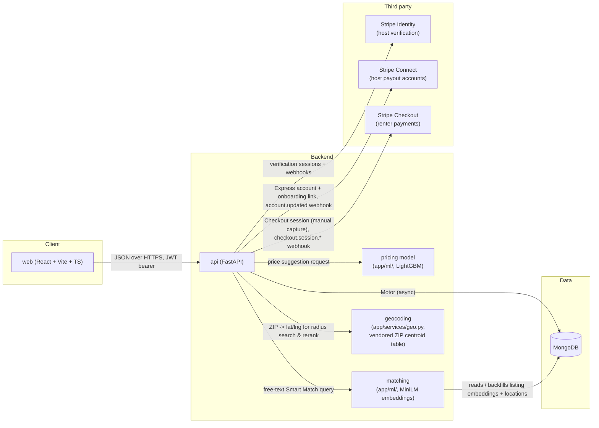
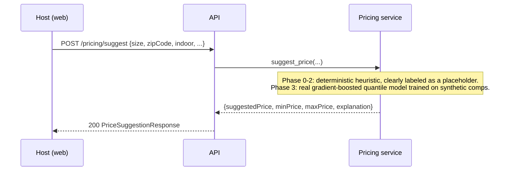
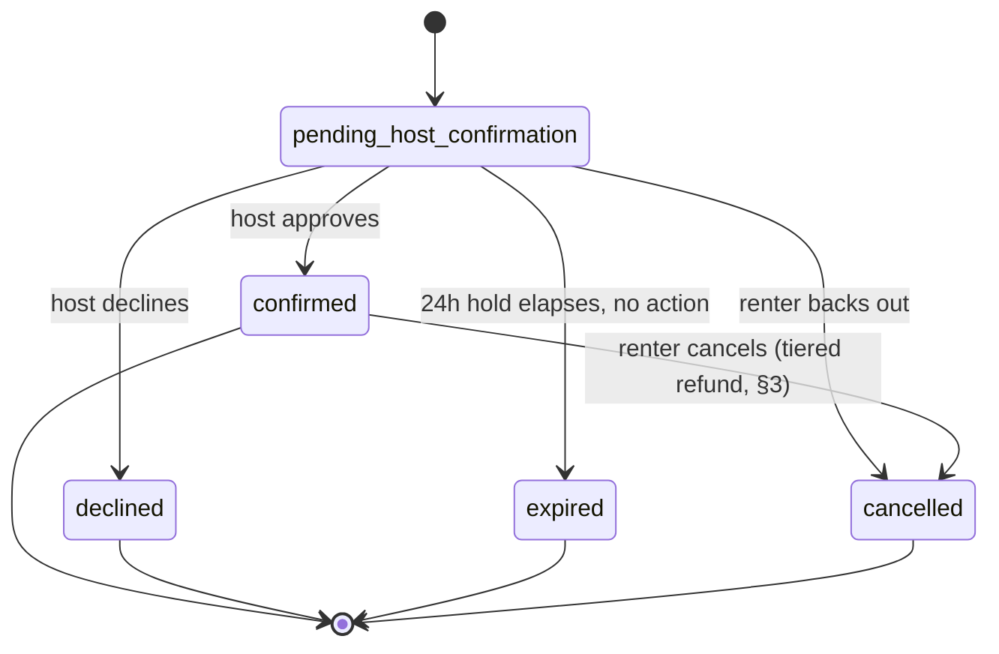

# Spacio — Engineering Documentation

This is a living engineering log and decision record. It is updated in the
same commit as any change it describes — if you find a stale section, that's
a bug, not a style choice.

## 1. Overview

Spacio is a peer-to-peer storage marketplace: people with unused space
(garages, closets, spare bedrooms) list it, and people who need storage rent
exactly the square footage they need, for exactly the dates they need it,
from a verified host nearby. See the [README](../README.md) for setup and
project structure. The full business thesis and customer research are
summarized in the decision log (§10) where they first became relevant to a
technical choice.

## 2. Architecture



### Request flow: creating a booking

```mermaid
sequenceDiagram
    participant R as Renter (web)
    participant A as API
    participant M as MongoDB

    R->>A: POST /reservations {listingId, sqftRequested, startDate, endDate, ...}
    A->>M: find listing by id
    A->>M: find overlapping reservations (status in [pending, confirmed])
    A->>A: sum reserved sqft; check sqftRequested <= totalSqft - reserved
    A->>A: calculate cost (base + service fee + box + insurance)
    A->>M: insert reservation (status=pending_host_confirmation, paymentStatus=pending_payment, holdExpiresAt=+24h)
    A-->>R: 201 ReservationPublic
    R->>A: POST /payments/checkout/{id} -> Stripe Checkout (card authorized, not charged)
    Note over A,M: Host later calls POST /reservations/{id}/approve (captures the card)<br/>or /decline (releases the hold). No action within 24h -> expired, hold released (background sweep, §3).<br/>Renter can POST /reservations/{id}/cancel: releases the hold before approval, tiered Stripe refund after (§3).
```

### Request flow: price suggestion (host creating a listing)



## 3. Tech stack decisions

### FastAPI

**What:** Python async web framework for the `api/` service.
**Why:** Native async support pairs naturally with Motor's async MongoDB
driver, so a slow database call doesn't block the event loop. Pydantic
integration gives us request/response validation and OpenAPI docs for free,
which matters when the frontend and ML service both consume this API.
**Alternatives considered:** Django REST Framework — more batteries included
(admin, ORM), but the ORM assumes a relational model we're deliberately not
using yet, and DRF's sync-by-default views fight async Mongo drivers. Flask —
lighter, but no built-in validation or async story as clean as FastAPI's.
**Tradeoffs accepted:** Smaller ecosystem than Django for things like admin
panels; we don't need one yet.
**Revisit if:** We need a full admin/back-office UI, at which point Django's
batteries might outweigh FastAPI's async-first design.

### MongoDB (via Motor, the async driver)

**What:** Document database, accessed via Motor.
**Why:** Listings have heterogeneous, evolving attributes (size, boxes,
insurance, future geo fields), and a document model avoids migrations during
rapid iteration. The v1 prototype was already built on Mongo, and there was
no correctness reason to force a rewrite before Phase 0 shipped.
**Alternatives considered:** Postgres + PostGIS + pgvector — stronger
relational integrity and real multi-document transactions, which matter for
bookings. Rejected for now because the rewrite cost isn't justified before
the product has real users or real bookings to migrate.
**Tradeoffs accepted:** No multi-document transactions by default, so the
reservation capacity check (read overlapping reservations, then insert) has a
theoretical race under concurrent writes — two renters could both pass the
capacity check for the last available square footage before either insert
commits. This is documented as a known limitation (§11); a
`findOneAndUpdate`-based reservation counter or a move to a transactional
store is the fix if booking volume ever makes this a real risk.
**Revisit if:** Bookings need real ACID transactions, or reporting queries
get relationally complex enough that Mongo's aggregation pipeline becomes
harder to reason about than SQL joins.

### React + Vite + TypeScript

**What:** Frontend framework, build tool, and type system for `web/`.
**Why:** Vite's dev server is fast enough to not think about; TypeScript
catches an entire class of "field renamed on the backend, frontend still
reads the old name" bugs that a JS-only prototype like v1 was exposed to.
**Alternatives considered:** Next.js — server-side rendering isn't a
requirement for an authenticated marketplace app behind a login wall, and it
adds a Node server we'd have to operate. Plain Vite + React keeps deployment
to a static host (Vercel) simple.
**Tradeoffs accepted:** No SSR means no meaningful SEO for listing pages if
that ever matters for organic discovery; acceptable for a college-town launch
that leans on ambassador-driven distribution, not search traffic.
**Revisit if:** Organic/SEO traffic becomes a real acquisition channel.

### Tailwind CSS

**What:** Utility-first CSS framework.
**Why:** The v1 prototype already used it effectively and consistently; a
switch to CSS Modules or styled-components would be a pure rewrite cost with
no correctness or business benefit.
**Alternatives considered:** None seriously — inherited a working choice.
**Tradeoffs accepted:** Utility classes in JSX read as noisy to newcomers;
mitigated by keeping components small once `App.tsx` is split (Phase 4).

### React Query (`@tanstack/react-query`)

**What:** Server-state cache and data-fetching library.
**Why:** Reservation and listing data changes from multiple actors (host
approves, renter books) and needs to stay in sync across components without
manual cache invalidation code. React Query's `invalidateQueries` pattern
does this with far less code than hand-rolled `useEffect` fetching, which is
what a from-scratch rewrite would otherwise produce.
**Alternatives considered:** Redux Toolkit Query — comparable, but pulls in
Redux's mental model for what is otherwise a fairly simple app with no
complex client-only state.
**Tradeoffs accepted:** Another dependency and cache-key discipline to
maintain (query keys must match between the component that fetches and the
mutation that invalidates).
**Revisit if:** Client-side state (not server state) becomes complex enough
to need a dedicated state manager.

### JWT auth (not sessions, not OAuth)

**What:** Stateless JSON Web Tokens issued on login, delivered as an
`HttpOnly` cookie (with an `Authorization: Bearer` header accepted as a
fallback for non-browser callers), validated per-request via `python-jose`.
**Why:** No server-side session store to run or scale; a single `/auth/me`
lookup validates the token and loads the current user. This matches a
FastAPI + Mongo stack without adding Redis just to hold sessions.
**Alternatives considered:** Server-side sessions — simpler to revoke
instantly, but requires a shared session store the moment we run more than
one API instance. Full OAuth (Google/Apple sign-in) — good for reducing
signup friction, but adds a provider integration before we've validated the
core product; deferred, not rejected.
**Tradeoffs accepted:** JWTs can't be revoked before they expire without an
explicit denylist (we don't have one yet — see §11). The token used to live in
`localStorage` (inherited from v1), which was vulnerable to XSS token theft;
fixed by moving to an `HttpOnly` cookie plus a 401 interceptor — see §7.
Cookie-based auth in turn means CSRF is the relevant threat model instead of
XSS-token-theft; mitigated with `SameSite=Lax`, without a separate CSRF
token yet (tracked in §11 as a possible defense-in-depth addition).
**Revisit if:** We add social login, or need instant token revocation (e.g.,
"log out all devices").

### Stripe Identity (host verification)

**What:** Stripe's document + selfie identity verification product, used to
gate host listing creation.
**Why:** Customer research (n=16) found host verification is the single
biggest trust lever (93.8% cited security of belongings, 87.5% cited trusting
unknown people as top objections). Building ID verification in-house is a
compliance and liability burden Spacio shouldn't take on directly; Stripe
already handles document authenticity checks, selfie matching, and PII
storage.
**Alternatives considered:** Persona, Onfido — comparable identity
verification products. Stripe was chosen because Checkout and Connect are
also on the roadmap (now built — see below), and consolidating on one vendor
for identity + payments simplifies both integration and reconciliation.
**Tradeoffs accepted:** Vendor lock-in to Stripe's verification UX and
pricing. Webhook-based status updates mean verification status can lag by
seconds; the frontend polls `/verification/status` to compensate (see
`VerificationCard` in the web app).
**Revisit if:** Stripe Identity pricing or coverage becomes a blocker in a
target market.

### Stripe Connect (host payouts)

**What:** Each host gets a Stripe **Express** connected account, created and
onboarded through a redirect flow that mirrors the Identity one
(`POST /payments/connect/onboard` returns a Stripe-hosted `AccountLink` URL;
`GET /payments/connect/status` + the `account.updated` webhook track when the
account reaches `charges_enabled && payouts_enabled`). Creating a listing is
gated on `stripeConnectOnboarded` in addition to identity `verified` — a
listing Spacio can't pay out on is not worth publishing.
**Why Express (not Standard or Custom):** Standard requires an OAuth
connection flow and gives the host a full Stripe dashboard login Spacio
doesn't want to expose; Custom makes Spacio responsible for building and
maintaining every screen of the onboarding + compliance UI and for handling
disputes/KYC directly. Express is the middle option: Stripe hosts onboarding,
KYC, tax forms, and a limited payout dashboard, while Spacio controls the
money movement and keeps its `application`-side fee.
**Accounts API version:** built on Connect **Accounts v1**
(`stripe.Account.create(type="express")`), which requires the "Accounts v1
support" feature toggle to be enabled on the platform account. Stripe now
steers *new* integrations toward Accounts v2 (`POST /v2/core/accounts`), but
v2 needs a much newer SDK than the pinned `stripe==10.11.0` and a different
onboarding + webhook surface. v1 is still fully supported (no end-of-life
date) and keeps this change small and low-risk; a v2 migration is a possible
future item. See §10.
**Tradeoffs accepted:** onboarding completion is only known via webhook /
poll, so there's a short window where a returning host shows "in review";
`PayoutOnboardingCard` polls to compensate. A host whose account is later
restricted by Stripe keeps their listings visible until the next approval
attempt fails (§11).

### Stripe Checkout + manual-capture payments

**What:** `POST /payments/checkout/{reservation_id}` creates a Stripe
Checkout Session for the reservation's `totalPrice` and returns a
Stripe-hosted URL, same redirect shape as Identity/Connect. The Session's
PaymentIntent is created with `capture_method="manual"` — the renter's card
is *authorized* (funds held) when Checkout completes, not charged yet. The
host's approval is the actual charge:
`reservations.approve_reservation` calls
`services/reservation_payments.py::capture_reservation_payment`, which
raises rather than confirming the reservation if the capture fails, so a
"confirmed" reservation always means the renter was actually charged. A
decline, an abandoned/expired Checkout, or the renter cancelling their own
still-pending reservation instead calls `cancel_reservation_payment`, which
releases the hold via `PaymentIntent.cancel` (best-effort — a Stripe error
there must never block the decline itself). `GET
/payments/checkout/status/{reservation_id}` polls the live PaymentIntent
status, same pattern as `connect_status`/`get_verification_status`: never
500s on a Stripe error, falls back to the stored value.
**Money split:** the Session's `payment_intent_data` sets
`transfer_data.destination` to the host's Connect account and
`application_fee_amount` to the reservation's own `serviceFee` (already
20% of the base price — the same number already shown to the renter in the
booking quote). So Spacio's cut and the host's payout are read directly off
numbers the renter already saw, not recomputed separately at charge time.
**Why manual capture, not automatic:** the business flow requires a host
approval step *before* money moves — an automatically-captured charge would
mean the renter is billed for a reservation the host might still decline.
Manual capture lets Checkout authorize the card immediately (so the renter
commits at booking time, same as v1's Stripe checkout link) while deferring
the actual charge until the host acts, and cleanly maps decline/expiry to
"release the hold" instead of "charge then refund."
**`paymentStatus` values:** `pending_payment` (reservation created, no
successful Checkout yet) → `authorized` (Checkout completed,
`checkout.session.completed` webhook or the status-poll endpoint recorded
the PaymentIntent) → `captured` (host approved) **or** `canceled` (host
declined / renter cancelled while pending) **or** `payment_expired`
(Checkout Session expired unused — `checkout.session.expired`; the renter
can retry from "My Reservations"). After a renter cancels a *confirmed*
booking (below): `refunded` (full) or `partially_refunded` (50%), with the
dollar figure in `refundedAmount`.
**Tradeoffs accepted:** Stripe's own authorization hold on a card only
lasts about 7 days. The hold-expiry sweep (`app/services/hold_expiry.py`,
below) releases any outstanding `authorized` PaymentIntent well before
that, so this only matters if the sweep itself has been down for multiple
days — at that point `approve` would call `PaymentIntent.capture` on an
authorization the issuing bank already released and get a Stripe error
(surfaced as the existing 502, not a silent failure). Checkout's amount and
the Connect destination are always read from the server-stored reservation
and listing documents, never from client input, so there's no path for a
renter to alter what they're charged or where it's sent.
**Revisit if:** running more than one API replica — the sweep is a single
in-process `asyncio` loop (§3's hold-expiry section, below), so a second
replica would double-run it. Every branch is idempotent ($set + a
best-effort `PaymentIntent.cancel`), so double-running is harmless, just
wasteful; worth moving to a leader-election or single-worker-only scheme
before that matters.

### Renter cancellation & the tiered refund

**What:** `POST /reservations/{id}/cancel` (renter only). Before the host
approves, it's identical to a host decline — `cancel_reservation_payment`
releases the authorization hold, no charge. After approval, when the
payment is already `captured`, it runs the tiered policy in
`app/services/refund_policy.py::decide_refund`:

| when the renter cancels | refund |
| --- | --- |
| ≥ 72h before the start date | 100% of `totalPrice` |
| < 72h before the start date | 50% of `totalPrice` |
| on/after the start date | none — endpoint 409s, "contact support" |

Either way the reservation ends in the new terminal state `cancelled`,
which is **not** in `CAPACITY_HOLDING_STATUSES`, so the square footage it
was holding is immediately free for another booking.

**Why the fee is refunded proportionally, not kept:** the refund is a flat
fraction of the whole `totalPrice`, service fee included. On the Stripe
side that's a single partial `Refund` with `refund_application_fee=True` +
`reverse_transfer=True`, which makes Stripe apply the same proportion to
the platform fee and to the transfer already sent to the host's connected
account — so a 50% refund claws back 50% of each with no separate
bookkeeping. Keeping the fee non-refundable was considered (it maps just as
cleanly to Stripe, `refund_application_fee=False`) but rejected: the 72h
tier already protects the host from last-minute cancellations, and a
"we keep our cut even when you cancel early" rule reads worse than it
saves at this scale.

**Why not best-effort like `cancel_reservation_payment`:**
`refund_reservation_payment` *raises* on a Stripe error (surfaced as 502).
Releasing an unspent authorization can safely be fire-and-forget — the hold
lapses on its own — but a failed refund means real money stays captured, so
the reservation must stay `confirmed` and the renter must see the failure
rather than a reservation that looks cancelled with no money back.

**Why a dedicated endpoint, not `DELETE`:** `DELETE /reservations/{id}` now
409s for a `confirmed` reservation and points here. Deleting the document
would lose the refund audit trail (`refundedAmount`, the `cancelled`
status), and a 204 with no body can't carry the refund result back to the
UI. `DELETE` stays for tearing down a still-pending request or clearing a
terminal record.

**Client mirror:** `web/src/lib/refundPolicy.ts` re-implements the two
tiers so the confirmation dialog can tell the renter what they'll get back
*before* they confirm; the server recomputes and is authoritative. Same
manually-kept-in-sync pattern as `reservationPricing.ts`.

### Reservation hold-expiry sweep

**What:** A background `asyncio` task, started from `main.py`'s `lifespan`
alongside the app itself, that calls
`app/services/hold_expiry.py::expire_stale_holds` every 60 seconds. It finds
every reservation still `pending_host_confirmation` whose `holdExpiresAt`
has passed, flips it to `expired`, and releases any outstanding payment
authorization via the same `cancel_reservation_payment` decline/cancel
already uses — so an expired hold and a host decline end up in exactly the
same state. Only started when `Settings.stripe_configured` is true: without
Stripe, no host can finish Connect onboarding, so no listing (and no
reservation) can exist yet.
**Why a plain `asyncio` loop, not APScheduler/Celery/cron:** this is a
single-process deployment (no separate worker dyno, no message queue) doing
one simple periodic query — the same "correct at this scale, revisit before
multiple replicas" reasoning already used for the in-memory rate limiter.
Adding a scheduler dependency for a 15-line loop would be the kind of
premature infrastructure this project has otherwise avoided.
**Why the sweep function is separate from the loop:** `expire_stale_holds`
takes no time-related arguments except an optional `now` and does no
sleeping, so it's called directly (not through the loop) in
`api/tests/test_hold_expiry_sweep.py` against a real test database — no
need to fast-forward a clock or wait out a real 60-second interval in CI.
The scheduling wrapper (`run_forever`) is untested by design: it's a
one-line `while True: ... ; await asyncio.sleep(...)`, thin enough that a
test would just be re-asserting Python's own semantics.
**Verified live, not just in tests:** started the real app, created a
reservation through the actual API, backdated its `holdExpiresAt` directly
in Mongo, and polled `GET /reservations/` until the running background
task — inside the real `lifespan`, not simulated — flipped it to `expired`
with `paymentStatus: "canceled"`. This matters because the pytest test
client's `ASGITransport` never triggers FastAPI's `lifespan` at all (see
`conftest.py`'s `clean_database` fixture, which has to call
`ensure_indexes()` itself for that exact reason) — so no automated test in
this repo actually exercises the task getting scheduled at app startup;
only this manual run does.
**Revisit if:** running more than one API replica (see above), or if the
60-second poll interval becomes a real cost at scale — an index on
`(status, holdExpiresAt)` keeps each poll cheap for now (see §4).

### Review system

**What:** `POST /reviews/` lets a renter rate (1–5) and optionally comment
on a reservation once it's actually happened — `app/services/
review_eligibility.py::assert_can_review` requires `status == "confirmed"`
**and** `endDate` in the past, and a unique index on `reviews.reservationId`
(app/db.py) makes one-review-per-stay a real DB constraint, not just an
application check. Reviews are scoped to the *reservation*, not the
listing: a renter who books the same listing again gets an independent
chance to review that stay too. `GET /reviews/listing/{id}` is public (no
auth) so search results and the listing detail view can show reviews to
anyone; `GET /reviews/reservation/{id}` is scoped to the renter or host on
that one reservation, and returns `null` (not 404) when nothing's been
written yet, so the frontend can render "leave a review" vs. "you already
reviewed this" without a try/catch.
**Rating aggregation:** every `POST /reviews/` recomputes the listing's
`rating` and `reviewCount` from a full `$avg`/`$sum` over that listing's
reviews (`_recompute_listing_rating`), rather than maintaining a running
average incrementally. Always correct even under concurrent writes, and
cheap at this project's scale — the same tradeoff already made for "no ANN
index" and "no pagination" (§11).
**Why gated on `endDate` in the past, not just `status == confirmed`:** a
reservation is "confirmed" from the moment the host approves, which can be
well before the stay itself happens. Allowing a review immediately on
approval would let a renter rate a stay they haven't experienced yet.
**Still honest about `rating`:** exactly the same policy `create_listing`
already had (§5, §11) — `rating` stays genuinely `null` until a listing has
a real review; `reviewCount` differs in that it's a real number (0, not
null) from the moment a listing exists, since "zero reviews" isn't a
fabricated value the way a hardcoded `4.7` would be.
**Tradeoffs accepted:** reviews can't be edited or deleted once submitted —
matches the scope of what was asked (create + read), and a low-stakes gap
at this project's current traffic. No review of the *renter* by the host
exists (only listing reviews), and no reported-review/moderation flow
exists either.
**Revisit if:** reviews need to be disputed or moderated before this
handles real public traffic, or if the host side of trust (rating renters)
becomes a real product need.

### Pricing model (real model as of Phase 2)

**What:** `/pricing/suggest` returns a suggested monthly price for a new
listing from a trained model — three LightGBM quantile regressors
(`api/app/services/ai_pricing.py`, `app/ml/`) — replacing the Phase 0/1
deterministic heuristic.
**Why a real model now:** Phase 0/1 shipped a deterministic heuristic
instead of a trained model because there was no booking history to train on
— a fabricated "AI" that silently randomizes its output (the v1 prototype's
behavior) is worse than an honestly-labeled placeholder. Phase 2 replaces
that placeholder with a real gradient-boosted quantile regressor trained on
a clearly-labeled *synthetic* comps dataset — still not real booking data
(there still isn't any), but a genuine trained model rather than a fixed
formula. Full write-up in §6.
**Alternatives considered:** Waiting for real booking history before
training anything. Rejected for the same reason the heuristic shipped early
in Phase 0/1: the create-listing flow benefits from a real estimate now, as
long as the synthetic training data is stated plainly and never described
as real comps.
**Tradeoffs accepted:** Real accuracy on actual bookings is unknown — the
model's evaluated MAE (§6) only measures how well it recovered a synthetic
formula, not real-world pricing behavior. Must be retrained on real booking
history once Spacio has enough of it.
**Revisit if:** Real booking/listing-price history accumulates (tracked in
§10 decision log).

### Embeddings / semantic search

**Built in Phase 2 (2026-08-27).** `POST /matching/recommend` ("Smart
Match") is now real semantic search, replacing the v1 prototype's ~12-word
keyword dictionary (`KEYWORD_SIZE_HINTS`).

**How it works:**

- **Model:** `sentence-transformers/all-MiniLM-L6-v2` — a 6-layer distilled
  BERT, ~22M params, 384-dimensional output. Small enough to run on CPU on
  a modest box; widely benchmarked. Loaded once per process, lazily, on
  first use (`app/ml/embeddings.py`).
- **Indexing:** each listing's `title` + `description` is embedded into a
  unit vector when the listing is created or edited (`app/routers/listings.py`),
  stored on the listing document as `embedding` (§4). Listings that predate
  the feature, or were written while the model was unavailable, are
  embedded and persisted lazily the first time `/matching/recommend` sees
  them (`_ensure_listing_embeddings`).
- **Query time:** the renter's free-text query is embedded the same way,
  then scored against every listing vector by **cosine similarity** — which,
  because all vectors are L2-normalized, is just a dot product. This is the
  dominant ranking signal.
- **Reranking:** the semantic score is then nudged by the structured
  signals — an exponential **distance decay** from the search origin
  (≤0.15, halving roughly every ~10 miles; see "Geography & distance
  search" below), a small price term (≤0.08, favouring cheaper), and, if the
  caller passes dates, an availability-window fit bonus / miss penalty.
  Weights live as named constants at the top of `app/services/matching.py`;
  they're deliberately small so a far-away exact-text match never outranks a
  nearby near-match, but they break ties among similarly-relevant listings.
  Not formally tuned — there's no labelled relevance data to tune against
  (see limitations).
- **Why "bicycle" now finds "great for cyclists":** the keyword version
  matched substrings, so a query and a listing that meant the same thing
  but shared no words scored zero. Embeddings place text near other text
  with similar *meaning*, so synonyms, paraphrases and descriptions
  ("somewhere for my road bike") all land close to a listing that says
  "ideal for cyclists".

**Design choices:**

- `app/services/matching.py` is pure and model-free: it takes the query
  vector, an optional `(lat, lng)` origin, and listings that already carry
  an `embedding` and a `location`, and does nothing but arithmetic (the only
  import beyond numpy is `haversine_miles` from `app/services/geo.py`). It
  never imports torch, so it unit-tests instantly with hand-built toy
  vectors (`tests/test_matching.py::TestRanking`). Producing the vectors and
  geocoding the origin are the router's job.
- **Brute-force comparison, no ANN index.** `/matching/recommend` loads all
  listings and scores them in a loop. At Spacio's scale (hundreds of
  listings) this is trivially fast and an approximate-nearest-neighbour
  index (FAISS, `pgvector`, Atlas Vector Search) would be premature. This is
  the obvious thing to revisit if the listing count grows by orders of
  magnitude.
- **Graceful degradation.** `EMBEDDINGS_ENABLED=false` (or any model
  load/download failure) makes `/matching/recommend` fall back to a
  non-semantic ranking (distance + price only), and its `explanation` string
  says so rather than pretending the results are semantically ranked. The
  test suite sets `EMBEDDINGS_ENABLED=false` so the ~90MB download and ~1s
  load don't happen for the ~76 tests that have nothing to do with
  matching; `tests/test_matching.py::TestRealEmbeddings` opts back in and
  exercises the real model end-to-end.
- **Dependency cost, accepted.** `sentence-transformers` pulls in `torch` +
  `transformers`. `requirements.txt` uses PyTorch's CPU wheel index so the
  install is the ~200MB CPU build, not the ~2.5GB CUDA one (see the comment
  at the top of that file); the Dockerfile bakes the model into the image
  so the first search after a deploy doesn't block on a download. A lighter
  ONNX-based embedder (`fastembed`) was considered; `sentence-transformers`
  was chosen as the more standard, recognizable API (see §10).

**Known limitations:**

- **No relevance evaluation.** We can show that "bicycle" now matches a
  "cyclists" listing (there's a test), but there's no labelled "good match"
  dataset, so there's no precision@k number here — same honesty caveat as
  the pricing model's synthetic-data MAE.
- Rerank weights are hand-set, not tuned.
- Brute-force scan; no ANN index (fine at current scale).
- The query is embedded on every request (~10–50ms on CPU); not cached.

### Geography & distance search

**Built in Phase 4 (2026-09-03).** Search and Smart Match understand real
distance now, not just ZIP-string equality.

**Geocoding — ZIP centroid.** A listing stores a 5-digit `zipCode` and a
neighbourhood-level `addressSummary` (never a street address — a deliberate
host-privacy choice), so the only geocoding possible is ZIP → centroid.
`app/data/zip_centroids.csv` (vendored from the US Census 2020 ZCTA
gazetteer, public domain, ~33k rows, committed to the repo) maps each ZIP
Code Tabulation Area to its interior point; `app/services/geo.py` loads it
once and exposes `zip_to_coords`, `haversine_miles`, `to_geojson_point`.
`app/data/build_zip_centroids.py` regenerates the CSV and documents its
provenance. Accuracy is therefore ZIP-centroid level (~1–3 miles in a
typical suburban ZIP) — honest about what the data is, and enough for
"storage within N miles"; it is not rooftop geocoding (§11).

**Storage & index.** Each listing carries a `location` GeoJSON Point (§4),
set from its ZIP on create/update and by `seed.py`, and lazily backfilled
for older rows the first time a geo search or a Smart Match touches them
(same pattern as `embedding`). A `2dsphere` index on `location` backs the
query; it naturally skips documents with no point, so a listing whose ZIP
didn't geocode is simply absent from distance results rather than an error.

**Search.** `GET /listings` takes `lat`/`lng`/`radiusMiles` (default 25).
When the request has an origin — explicit coordinates ("near me"), or a
`zipCode` that geocodes — it runs a `$geoNear` aggregation: distance-bounded,
nearest-first, with `distanceMiles` reported on each result. A `zipCode`
that isn't a real ZCTA falls back to the original prefix match on the ZIP
string, so nothing regresses. `lat`/`lng`/`distanceMiles` are projected onto
`ListingPublic` from the stored `location` by a before-validator, so they're
response-only — the DB is the single source of truth for the point.

**Matching.** `POST /matching/recommend` accepts `lat`/`lng` and geocodes
`zipCode` the same way; the reranker's old flat exact-ZIP / shared-prefix
bonus is now the exponential distance-decay term described above.

**Frontend.** The Landing results view is an Airbnb-style split: cards on the
left, a **Leaflet + OpenStreetMap** map on the right (sticky on desktop) with
a marker per result whose popup opens the listing detail modal. A radius
selector and a "Use my location" button (browser geolocation → the radius
search) sit under the search bar; cards and popups show "x mi away".

**Design choices / limitations:**

- **No external geocoder.** An address-level geocoder (Nominatim, Census,
  Mapbox) would be more accurate but needs network + keys, is
  non-deterministic (CI flakiness), and there's no street address stored to
  geocode. The vendored centroid table is offline, deterministic, and
  free — see §10.
- **Leaflet + OSM raster tiles**, chosen over MapLibre GL / Mapbox GL for
  zero API keys and no billable account. Uses OpenStreetMap's public tile
  server, which is fine at this traffic but would need a proper tile
  provider at scale (§11).
- **Still a brute-force scan in the matcher** (the `$geoNear` path in
  `GET /listings` does use the index); no ANN / geo pre-filter there —
  fine at hundreds of listings.

### Hosting

**Not yet implemented.** Planned for Phase 2: MongoDB Atlas, API on
Render/Fly.io, web on Vercel. Documented in full once deployed (§9).

## 4. Data model

All collections use a UUID4 string as `_id` (not Mongo's default ObjectId),
generated application-side. This keeps IDs opaque and consistent across
services without leaking Mongo internals into API responses.

### `users`

| Field | Type | Notes |
|---|---|---|
| `_id` | string (UUID4) | |
| `name` | string | |
| `email` | string | Unique — see index below |
| `hashed_password` | string | `pbkdf2_sha256` via passlib |
| `zipCode` | string | |
| `isHost` | bool | |
| `phone` | string \| null | |
| `createdAt` | datetime | |
| `backgroundCheckAccepted` | bool | Self-attested at registration; see §7 for why this must never by itself set `verificationStatus` to a verified state |
| `verificationStatus` | string | `pending` \| `processing` \| `verified` \| `requires_input` \| `cancelled` |
| `stripeVerificationSessionId` | string \| null | Set once a Stripe Identity session is created |

**Indexes:** unique index on `email`. The v1 prototype checked-then-inserted
without a unique constraint, which is a race condition (two concurrent
registrations with the same email could both pass the existence check). A
unique index makes the database reject the second insert instead of silently
creating a duplicate account.

### `listings`

| Field | Type | Notes |
|---|---|---|
| `_id` | string (UUID4) | |
| `hostId` | string | FK to `users._id` |
| `title`, `description` | string | |
| `size` | enum `S`\|`M`\|`L` | Derived bucket from `sizeSqft`, kept for backward-compatible filtering |
| `sizeSqft` | float | Total square footage of the space |
| `pricePerMonth` | float | Host-set monthly rate for the *whole* space, $25–70 realistic range |
| `addressSummary`, `zipCode` | string | |
| `images` | string[] | |
| `availability` | bool | |
| `availableFrom`, `availableTo` | datetime \| null | |
| `bookingDeadline` | datetime \| null | |
| `rating` | float \| null | **Fabricated in v1** (hardcoded 4.7 on every listing). Real now (§3's "Review system"): the average of that listing's reviews, recomputed on every `POST /reviews/`; `null` until the first one. |
| `reviewCount` | int | Real count of reviews, defaults to `0` (not `null` — unlike `rating`, zero is an honest value from the moment a listing exists). |
| `embedding` | float[384] \| null | Sentence embedding of `title` + `description` (`all-MiniLM-L6-v2`), used by `/matching/recommend` for semantic search (§3). Written on listing create/update; `null` if embeddings were disabled or the model was unavailable at write time, in which case `/matching/recommend` backfills it lazily on the next search. Never returned in API responses. |
| `location` | GeoJSON Point \| null | `{"type": "Point", "coordinates": [lng, lat]}` — the centroid of `zipCode` (§3's "Geography & distance search"). Set on create/update and by `seed.py`; `null` when the ZIP didn't geocode, backfilled lazily on the next geo search. Not returned directly — `ListingPublic` projects it to `lat`/`lng` (and a search adds `distanceMiles`). |
| `createdAt` | datetime | |

**Indexes:** `2dsphere` on `location`, required by the `$geoNear`
radius-search aggregation (§3).

### `reservations`

| Field | Type | Notes |
|---|---|---|
| `_id` | string (UUID4) | |
| `listingId`, `renterId` | string | |
| `startDate`, `endDate` | datetime | |
| `sqftRequested` | float | |
| `numBoxes` | int | Secure box add-on count, $10/box/month, prorated like the base price |
| `insuranceDeclaredValue` | float \| null | Drives the insurance tier (§5); `null` if no Spacio insurance was purchased |
| `hasOwnInsurance` | bool | If true, renter supplied proof of their own insurance instead of buying Spacio's |
| `status` | enum | `pending_host_confirmation` \| `confirmed` \| `declined` \| `expired` \| `cancelled` (renter cancelled — §3) |
| `basePrice`, `serviceFee`, `boxCost`, `insuranceCost`, `totalPrice` | float | See §5 for the formula |
| `holdExpiresAt` | datetime | 24h from creation; the background sweep (§3) expires it and releases any payment hold |
| `createdAt` | datetime | |
| `paymentStatus` | enum | `pending_payment` \| `authorized` \| `captured` \| `canceled` \| `payment_expired` \| `refunded` \| `partially_refunded` — see §3's Checkout & cancellation sections |
| `refundedAmount` | float \| null | Dollars refunded when a confirmed booking was cancelled (§3's refund policy); `null` otherwise |
| `stripeCheckoutSessionId` | string \| null | Set once the renter starts Checkout; never returned in API responses |
| `stripePaymentIntentId` | string \| null | Set by the `checkout.session.completed` webhook (or the status-poll fallback); what `capture`/`cancel` act on |

**Indexes:** compound index on `(listingId, status, startDate, endDate)` —
every capacity check and search-by-date query filters on exactly these
fields together. Separate `(status, holdExpiresAt)` index for the
hold-expiry sweep (§3), which has no `listingId` to filter on.

### `messages`

| Field | Type | Notes |
|---|---|---|
| `_id` | string (UUID4) | |
| `reservationId` | string | Scopes the conversation to one reservation |
| `senderId` | string | |
| `content` | string | |
| `createdAt` | datetime | |

**Indexes:** index on `reservationId` (every read filters by it).

### `reviews`

| Field | Type | Notes |
|---|---|---|
| `_id` | string (UUID4) | |
| `listingId` | string | Denormalized from the reservation at write time, so `GET /reviews/listing/{id}` doesn't need a join |
| `reservationId` | string | The specific stay this review is for — see §3's "Review system" for why reviews are scoped to a reservation, not a listing |
| `renterId` | string | |
| `rating` | int (1–5) | |
| `comment` | string \| null | Optional, max 1000 chars |
| `createdAt` | datetime | |

**Indexes:** unique index on `reservationId` (one review per stay, enforced
at the DB level, not just in `app/routers/reviews.py`); index on
`listingId` (every public listing-reviews read filters by it).

## 5. Business rules as implemented

This section must stay in exact sync with the business brief. If the code and
this section disagree, the code is wrong — file an issue against yourself.

### Pricing formula

```
base = hostMonthlyPrice × (sqftRequested / totalSqft) × (days / 30)
serviceFee = base × SERVICE_FEE_RATE
```

`SERVICE_FEE_RATE = 0.20` (20%). This was ambiguous across the v1 prototype's
own files — the business plan text said 10–15%, the financial model assumed
20%, `config.py` had `0.20`, and `env.example` had `0.10`. Resolved 2026-08-10
(see §10): **20%**, matching the financial model's reference unit economics
($40 host price → $8 to Spacio → $32 to host).

### Secure boxes (add-on)

`$10 per box per month`, prorated the same way as the base price:

```
boxCost = numBoxes × 10 × (days / 30)
```

Proration wasn't specified explicitly in the brief; it was chosen for
internal consistency with how every other price component in this formula is
time-prorated, rather than charging a flat $10 regardless of stay length.

### Insurance (declared-value tiers)

Priced by declared item value, not square footage — the v1 prototype charged
`sqftRequested × 0.15`, which was not the business model and has been
deleted.

| Declared value | Monthly cost |
|---|---|
| Up to $1,000 | $12 |
| $1,000–$3,000 | $20 |
| $3,000–$5,000 | $30 |
| $5,000–$10,000 | $45 |

Tier boundaries are treated as `(previous max, this max]` — a declared value
of exactly $1,000 falls in the first tier. Prorated by `days / 30` for the
same internal-consistency reason as box cost. Renters may instead set
`hasOwnInsurance = true` and supply proof of their own renter's insurance,
which waives the Spacio insurance charge entirely (no `insuranceDeclaredValue`
is charged in that case). Declared values above $10,000 are rejected — there
is no tier for them yet.

### Reservation total

```
total = base + serviceFee + boxCost + insuranceCost
```

### Capacity rule

A single listing can host multiple concurrent renters as long as the sum of
`sqftRequested` across all overlapping `confirmed` + `pending_host_confirmation`
reservations never exceeds the listing's `totalSqft`. "Overlapping" means the
date ranges intersect: `existingStart < newEnd AND newStart < existingEnd`.
This was already correct in the v1 prototype and is preserved, now as a pure,
independently unit-tested function (`app/services/capacity.py`) rather than
logic embedded in a route handler.

### Reservation state machine



`declined`, `expired`, and `cancelled` are terminal; `confirmed` is terminal
*except* for a renter-initiated cancellation, which runs the tiered refund
in §3. A reservation cannot be approved after it's been declined, for
example. The v1 prototype did not enforce this (you could call `/approve`
on an already-declined reservation); `app/services/reservation_state.py`
now validates every transition.

The 24-hour auto-expiry runs as a background sweep (§3's "Reservation
hold-expiry sweep") that calls this same `is_hold_expired()` check every 60
seconds.

## 6. The pricing model

**Built in Phase 2 (2026-08-27).** `POST /pricing/suggest` is now served by
`app/services/ai_pricing.py`, backed by a real trained model rather than the
Phase 0/1 deterministic heuristic (`BASE_PRICES_BY_SIZE` etc., retired — see
git history if you need it).

**Training data provenance — synthetic, stated plainly.** Spacio has no real
booking or listing-price history yet, so there is nothing real to train on.
`app/ml/synthetic_pricing_data.py` generates 8,000 synthetic comp rows from
an explicit, documented generative formula (per-tier $/sqft rate, sublinear
sqft scaling, an indoor multiplier, log-normal noise, and a 5% chance of a
±25% outlier), seeded (`seed=42`) for full reproducibility. This formula is
deliberately *not* the same as the old heuristic it replaces — if it were,
the model would just be re-deriving a formula it was implicitly handed,
which would make the baseline comparison below circular. Every user-facing
`explanation` string returned by `/pricing/suggest` says "trained on
synthetic data, not real booking history" — this must never be softened to
imply the model is trained on real comps.

**Feature list and rationale** (`app/ml/features.py`, the single source of
truth for encoding — shared by training and inference so they can't drift
apart):

| Feature | Type | Rationale |
|---|---|---|
| `size` | categorical (S/M/L) | The bucket the host picks in `CreateListingForm`; kept even though `sizeSqft` is more granular because it's still part of the request contract and the frontend derives it from sqft either way. |
| `sizeSqft` | numeric | The real driver of cost. Previously collected in the create-listing form but never sent to `/pricing/suggest` — now included in `PriceSuggestionRequest`. |
| `zip_demand_tier` | categorical (low/mid/high) | Derived from the ZIP3 prefix via a hand-labeled table in `features.py`, expanding the old heuristic's binary `HIGH_DEMAND_ZIP_PREFIXES` flag into 3 tiers. Still not real demand data (no bookings to derive it from) — same honesty caveat as before, just less crude. |
| `indoor` | boolean | Collected in the create-listing form (`indoor` state in `CreateListingForm.tsx`), not persisted on the listing itself — a transient pricing-suggestion input only. |

`title`/`description` are accepted by `PriceSuggestionRequest` but not used
as model features. Free text is turned into a numeric signal by the Phase 2
matching model (§3, sentence embeddings) — but that's for ranking listings
against a query, not pricing. Feeding raw text embeddings into this
regressor without a reason to think description wording predicts price
would just add noise; revisit if real data shows otherwise.

**Model type and why:** three independent LightGBM quantile regressors
(`objective="quantile"`, `alpha` = 0.15 / 0.5 / 0.85), trained via
`app/ml/train_pricing_model.py`. Quantile regression was chosen over a
single point-estimate model because the product needs a `min`/`suggested`/
`max` spread, not just one number — the old heuristic faked that spread with
a fixed ±15% multiplier; the real model produces genuine p15/p50/p85
estimates instead. Gradient-boosted trees (vs. e.g. linear regression) were
chosen because the generative formula has a real nonlinearity (sublinear
sqft scaling) and a tier × indoor interaction that a linear model can't
capture, and because LightGBM handles the categorical features (`size`,
`zip_demand_tier`) natively without one-hot encoding. Hyperparameters
(`n_estimators=300`, `num_leaves=15`, `max_depth=5`, `learning_rate=0.05`)
are a reasonable default for a dataset this size, not results of formal
tuning — worth revisiting once real data replaces the synthetic set.

**Evaluation against a naive baseline, real numbers** (from the training run
that produced the committed artifact; reproduce with `python -m
app.ml.train_pricing_model` from `api/`):

| | MAE (held-out 1,600 rows) |
|---|---|
| Naive per-ZIP-tier $/sqft baseline | $10.28 |
| Trained model (median/p50) | $2.36 |
| Improvement | 77.1% |

The naive baseline (`_naive_baseline_mae` in `train_pricing_model.py`)
predicts `price = (mean training $/sqft for that ZIP tier) × sqft` — it
captures the ZIP/tier signal but none of the sqft-scaling, indoor premium,
or interaction effects, so a large model win here mostly confirms the
synthetic data actually has learnable structure beyond a flat per-sqft rate,
not that the model would perform this well on real bookings.

**Artifact versioning:** the trained bundle (all three quantile models plus
metadata: feature columns, training timestamp, seed, LightGBM version, and
the metrics table above) is serialized with `joblib` to
`app/ml/artifacts/pricing_model_v1.joblib` and **committed to the repo** —
training is fully deterministic given the fixed seed, so committing the
artifact (rather than training at deploy time) keeps `docker compose up` and
a fresh clone working out of the box. `ai_pricing.py` loads a pinned
filename (`pricing_model_v1.joblib`); bump `VERSION` in
`train_pricing_model.py` and the loaded filename in `ai_pricing.py` together
whenever a feature-set or encoding change would make an old artifact
incompatible, so the two files can't silently drift onto different
contracts.

**Known limitations:**
- Trained entirely on synthetic data — real predictive accuracy on actual
  bookings is unknown and likely worse than the $2.36 MAE above, which only
  measures how well the model recovered a formula we wrote ourselves.
  Retrain on real booking history once Spacio has enough of it.
- The `zip_demand_tier` table is still a small hand-labeled list of Texas
  metro ZIP3 prefixes, same limitation as the old heuristic's ZIP list, just
  less coarse.
- No hyperparameter tuning; no cross-validation, just a single train/test
  split.
- Output is no longer clipped to the old fixed $25–70 heuristic band (see
  §11) — a small, low-demand, outdoor unit can now legitimately be
  suggested below $25/mo, which is more honest than an artificially fixed
  floor but is a behavior change worth knowing about.
- `title`/`description` are accepted by the endpoint but unused by the
  model (see feature table above).

## 7. Security

### Auth model

- Passwords hashed with `pbkdf2_sha256` (passlib), never stored or logged in
  plaintext.
- JWTs signed with HS256, `sub` claim = user ID, expiry from
  `ACCESS_TOKEN_EXPIRE_MINUTES`.
- Every protected route depends on `get_current_user`, which decodes the
  token and loads the user from the database — a forged or expired token is
  rejected with 401 before any handler code runs.
- Host-only actions (`create_listing`, `approve`/`decline` reservations)
  additionally check `isHost` and `verificationStatus == "verified"` /
  listing ownership in the handler.

### Known vulnerabilities inherited from v1, and their status

This table will be completed as each is fixed in Phase 1. Tracking it here
now so nothing gets silently forgotten between phases.

| Vulnerability | Status |
|---|---|
| Stripe webhook signature not verified (`stripe.Event.construct_from` on raw body) | Fixed — see below |
| `verificationStatus = "verified-mock"` self-attestation bypass at registration | Fixed — see below |
| `cors_origins` defaults to `["*"]` with `allow_credentials=True` | Fixed — see below |
| `jwt_secret` defaults to a literal string instead of failing fast when unset | Fixed — see below |
| JWT in `localStorage`, no expiry handling, no 401 interceptor | Fixed — see below |
| Upload endpoint trusts client-supplied `Content-Type`, no size limit | Fixed — see below |
| `GET /listings` returns raw Mongo documents instead of a response model | Fixed in Phase 0 — see below |
| No rate limiting on `/auth/login` or `/pricing/suggest` | Fixed — see below |

`GET /listings` now returns a typed response instead of raw documents so
undocumented fields never leak to unauthenticated callers.

The Stripe webhook now verifies the `stripe-signature` header via
`stripe.Webhook.construct_event` against `STRIPE_WEBHOOK_SECRET`, rejecting
forged and unsigned requests with a 400 — see
`api/tests/test_verification_webhook.py`.

`jwt_secret` and `cors_origins` (`app/core/config.py`) no longer have
defaults, so an unset `JWT_SECRET` or `CORS_ORIGINS` now fails startup
instead of silently signing tokens with a well-known key or opening the API
to any origin. `cors_origins` also has a validator that explicitly rejects
`"*"`, since that combined with `allow_credentials=True` (`main.py`) would
let any website read authenticated responses from a logged-in user's
browser.

`POST /listings/upload` (`app/routers/listings.py`) now: caps the read at
5MB (rejecting larger uploads with 413 without buffering the whole file);
decodes the bytes with Pillow and checks the real detected format instead of
trusting the client's `Content-Type` or filename extension; and writes back
the re-decoded pixel data rather than the raw uploaded bytes, which strips
EXIF metadata and any non-image bytes appended after the image data. See
`api/tests/test_listing_upload.py`.

`POST /auth/login` (5/minute) and `POST /pricing/suggest` (20/minute) are now
rate limited per caller IP via `slowapi`, returning 429 once exceeded — a
shared `Limiter` (`app/core/rate_limit.py`) is wired into `main.py` and
applied per-endpoint with `@limiter.limit(...)`. Login gets the stricter
limit since it's the brute-force/credential-stuffing target; pricing/suggest
just needs enough headroom for normal debounced typing in the host listing
form. Storage is in-memory, which is correct for the current single-process
deployment but would need a shared backend (e.g. Redis) before running
multiple API replicas. See `api/tests/test_rate_limiting.py`.

`POST /auth/register` (`app/routers/auth.py`) no longer accepts a client-
supplied `backgroundCheckAccepted` flag or sets `verificationStatus:
"verified-mock"` from it — every new user now always starts at `"pending"`,
regardless of request body. `"verified"` is only ever set by the real Stripe
Identity flow (`app/routers/verification.py`, driven by the signed webhook).
The dead `backgroundCheckAccepted` field was removed from `UserCreate`
(`app/models/schemas.py`), `seed.py`'s fixtures, and the frontend's register
form/payload type, since it never did anything the UI surfaced. See
`api/tests/test_api_authorization.py::test_registration_cannot_self_attest_verification`.

The JWT no longer lives in `localStorage`. `POST /auth/login`
(`app/routers/auth.py`) sets it as an `HttpOnly` cookie (`Secure` gated by
the new `COOKIE_SECURE` setting, `SameSite=Lax`) instead of returning it in
the JSON body — page JS can no longer read the session token at all, closing
the XSS-token-theft path the old `localStorage` model was exposed to.
`app/deps/auth.py`'s `get_current_user` reads the cookie first, falling back
to an `Authorization: Bearer` header for non-browser callers (scripts, this
test suite). A new `POST /auth/logout` clears the cookie (JS can't clear an
`HttpOnly` cookie itself). On the frontend, `api/client.ts` sets
`withCredentials: true` and drops the old manual header-attaching
interceptor, and adds a response interceptor that redirects to `/login` on
any 401 other than the initial `/auth/me` session check — the "no expiry
handling" half of this issue. Verified against a real browser (login →
`localStorage`/`document.cookie` both confirmed empty, cookie survives a
hard reload, logout invalidates the session immediately, and a live 401 on
an authenticated call triggers the redirect) in addition to the backend
test suite (`api/tests/test_api_authorization.py`,
`test_register_then_login_sets_httponly_cookie_and_authenticates` and
`test_bearer_header_still_works_as_a_fallback`).

### Rate limits

`POST /auth/login`: 5/minute per IP. `POST /pricing/suggest`: 20/minute per
IP. Both via `slowapi`, in-memory storage — see §7's vulnerability table
above for detail. No other endpoints are rate limited yet.

### Secrets

`.env` is gitignored; `env.example` documents every variable without real
values. Stripe keys are supplied by whoever runs the stack locally or in CI
secrets — never committed.

## 8. Local development

See the [README](../README.md#local-development) — kept there so there's one
canonical quickstart, not two documents that can drift apart.

## 9. Deployment

Not yet implemented. Planned for Phase 2 (MongoDB Atlas, API on Render/Fly.io,
web on Vercel). Will be documented here with environments, env vars, CI/CD,
and rollback steps once real.

## 10. Decision log

Append-only. Never delete an entry; if a decision is reversed, add a new one
that supersedes it and say why.

- **2026-08-10** — Chose a from-scratch rewrite over continuing
  `saachiraju/Team-07-Spacio` because the old repo doesn't run (Tier 1
  defects), has unverified webhook signatures and a trust-gate bypass (Tier 2),
  and the "AI" features are fabricated (Tier 3). A clean repo with real tests
  and CI from commit 1 was judged cheaper than untangling those in place.
- **2026-08-10** — Resolved the service fee ambiguity (business plan said
  10–15%, financial model assumed 20%, `config.py` had 0.20, `env.example`
  had 0.10) as **20%**, matching the financial model's reference unit
  economics. Single source of truth is `Settings.service_fee_rate` in
  `api/app/core/config.py`.
- **2026-08-10** — Chose to keep Stripe Identity wiring behind real test-mode
  keys supplied by the project owner rather than building a dev-mode stub
  that bypasses real API calls, so that the verification flow is exercised
  against the real Stripe API (in test mode) from day one instead of a
  second, divergent code path that would need its own maintenance.
- **2026-08-10** — Box and insurance costs are prorated by `days / 30`,
  matching the base price formula. Not explicit in the business brief;
  chosen for internal consistency rather than flat monthly charges
  regardless of stay length.
- **2026-08-10** — Ported `web/` deliberately rather than bulk-copying v1's
  2297-line `App.tsx`: split into `pages/`/`components/`/`lib/` (one file per
  page, not yet the full one-component-per-file split — that's Phase 4).
  Made three related calls while doing so, none dictated by the brief but
  each following directly from a ground rule already in it: (1) dropped v1's
  post-reservation redirect to a real Stripe checkout link (its own, from the
  old team's account) — `paymentStatus` is `mocked-success` server-side, so
  sending a user to a real payment page there would be dishonest, not just
  unnecessary; (2) dropped the `?? 4.7` fake-rating fallback in the UI to
  match the backend's genuine `null`; (3) relabeled "AI Match"/"AI
  suggestion" to "Smart Match"/"Price suggestion" to match what
  `services/matching.py` and `services/ai_pricing.py` actually are —
  heuristics, not AI — per the "never misrepresent in user-facing strings"
  rule.
- **2026-08-12** — Added `docker-compose.yml` plus a `Dockerfile` for each of
  `api/` and `web/`, completing the Docker quickstart the README already
  documented. Both services run in dev mode inside containers (`uvicorn
  --reload`, `vite --host 0.0.0.0`) with the source tree bind-mounted for hot
  reload, matching how they're run natively — this is a dev compose file, not
  a production build. `api/.dockerignore` excludes `.env` and `.venv` so
  secrets and the host virtualenv are never baked into the image layer.
- **2026-08-27** — Phase 2 (real pricing model): chose LightGBM over
  scikit-learn's built-in gradient boosting for the quantile regressors —
  both would have been legitimate, sklearn's `HistGradientBoostingRegressor`
  keeps the dependency footprint lighter, but LightGBM is the more
  industry-standard answer and its native categorical-feature handling fit
  `size`/`zip_demand_tier` cleanly. Also decided to commit the trained model
  artifact (`app/ml/artifacts/pricing_model_v1.joblib`) to the repo rather
  than training it at deploy time, since training is fully deterministic
  given the fixed seed — same reasoning as committing `docker-compose.yml`:
  keep a fresh clone working out of the box. Also locked in **Phase 5:
  deployment infra (EC2 running the API, S3 for listing/verification
  images)**, scheduled after Phase 2/3 feature work rather than before, so
  infra spend doesn't start while the feature set is still moving.
- **2026-08-28** — Phase 2 (semantic matching): replaced the keyword
  dictionary in `services/matching.py` with sentence-embedding search
  (§3). Chose `sentence-transformers` + `all-MiniLM-L6-v2` over the lighter
  ONNX-based `fastembed` (same model family, ~20MB of deps vs ~1GB) and
  over static-embedding `model2vec`: the heavier option was taken for the
  more standard, widely-recognized API, mitigated by pinning the CPU-only
  torch build (`requirements.txt` extra index) and baking the model into
  the Docker image. Kept `matching.py` a pure function of precomputed
  vectors (no torch import) so it stays fast to unit-test. Did **not** add
  an ANN index — brute-force scan is fine at hundreds of listings; revisit
  at scale. Embeddings stored per-listing on write, backfilled lazily on
  read; `EMBEDDINGS_ENABLED=false` disables the model for the test suite
  and degrades `/matching/recommend` to a ZIP+price ranking rather than
  failing.
- **2026-09-02** — Phase 4, PR-B: Stripe Checkout for renter payments,
  replacing `paymentStatus: "mocked-success"`. Chose manual-capture
  (`capture_method="manual"`) over an automatic charge specifically because
  the business flow requires host approval *before* money moves — see §3
  for the full reasoning. Split the money at the Checkout layer via Connect
  destination charges (`transfer_data.destination` = host's account,
  `application_fee_amount` = the reservation's own `serviceFee`) rather than
  charging Spacio's platform account and doing a manual transfer afterward,
  since the split is then computed once (in `reservation_pricing.py`) and
  reused everywhere instead of recomputed at charge time. Put the
  capture/cancel Stripe calls in a new `services/reservation_payments.py`
  rather than importing `routers/payments.py` from `routers/reservations.py`
  — small module, but keeps routers from importing each other. This
  followed **Phase 4, PR-A: Stripe Connect Express onboarding** for host
  payouts (`routers/payments.py`'s `/connect/*` endpoints, gating listing
  creation on `stripeConnectOnboarded`), which shipped first since Checkout
  needs a destination account to pay out to.
- **2026-09-02** — Phase 4: wired the 24-hour reservation hold-expiry sweep
  that had been logic-only-and-tested since Phase 0
  (`reservation_state.is_hold_expired`). Chose a plain `asyncio` background
  task started from `main.py`'s `lifespan`, polling every 60 seconds, over
  pulling in APScheduler/Celery/a cron container — same "right-sized for a
  single-process deployment" reasoning already applied to the in-memory
  rate limiter, and a 15-line loop didn't justify a new dependency. The
  sweep function itself (`expire_stale_holds`) takes an optional `now` and
  does no sleeping, so it's tested directly against a real database rather
  than through the scheduling loop. Added a `(status, holdExpiresAt)` index
  since the sweep's query has no `listingId` to piggyback on the existing
  compound index. Verified the actual background task starting at real app
  boot (not just the sweep function in isolation) by running the live app,
  backdating a reservation's hold, and confirming it flipped to `expired`
  with the payment hold released — necessary because pytest's ASGI test
  client never triggers FastAPI's `lifespan` at all, so no automated test
  here exercises the startup wiring itself.
- **2026-09-02** — Phase 4: real review system, replacing the "no reviews
  yet" placeholder. Scoped reviews to a *reservation* rather than a
  listing — closer to how verified-stay reviews actually work (Airbnb-style
  "only guests who stayed can review"), and it composes cleanly with
  eligibility (`status == confirmed` and `endDate` in the past) instead of
  needing a separate "did this renter ever complete a stay here" query. Ate
  the cost of also fixing `Profile.tsx`'s active/past reservation split —
  it previously bucketed every `confirmed` reservation as "active" even
  long after the stay ended, which would have buried the new "leave a
  review" prompt under "Active Reservations" indefinitely; small change,
  directly motivated by (and using the same `endDate`-passed check as) the
  review-eligibility rule, so it went in alongside it rather than as a
  separate cleanup PR. Chose recompute-the-full-average-on-write over an
  incremental running average for `listings.rating`/`reviewCount` — same
  "correct under concurrent writes, cheap at this scale" reasoning as other
  places in this codebase that chose simplicity over premature optimization
  (§11). Did not add review edit/delete, host-reviews-renter, or moderation
  — none were asked for, and the create+read scope shipped is a complete,
  independently useful slice on its own.
- **2026-09-03** — Phase 4: real geography. Two tradeoff decisions, both
  made with the project owner:
  - **Geocoding = vendored ZIP-centroid table** (US Census 2020 ZCTA
    gazetteer, public domain, committed as `app/data/zip_centroids.csv`),
    over (a) an address-level geocoder API — rejected because it needs
    network + keys, is non-deterministic (CI), and no street address is
    stored to geocode — and (b) a host pin-drop on a map — better accuracy
    but a much larger frontend change, and it still needs a centroid
    fallback for existing/seeded listings. Accepted cost: accuracy is
    ZIP-centroid (~1–3 mi), stated plainly in the UI and §11. The table is
    committed rather than downloaded at deploy time, same reasoning as the
    pricing-model artifact and `docker-compose.yml` — a fresh clone works
    offline.
  - **Map library = Leaflet + OpenStreetMap** (`react-leaflet` v4 + free OSM
    raster tiles), over MapLibre GL (needs a vector-tile/style source — the
    free ones are rate-limited or need signup) and Mapbox GL (needs a
    Mapbox account + access token, a billable account). Leaflet + OSM needs
    no key and no account; OSM's public tile server is acceptable at this
    traffic and flagged in §11 as needing a real provider at scale.
  - Search became a `$geoNear` radius query (2dsphere index on a new
    `listings.location` GeoJSON point), and the Smart Match reranker's flat
    exact-ZIP / shared-prefix bonus became an exponential distance decay.
    A `zipCode` that doesn't geocode falls back to the old prefix match, so
    the change is purely additive for existing callers. Kept
    `services/matching.py` a pure function (added only a stdlib haversine
    import) so it still unit-tests without a DB or a model.
  - **Not** in scope: the renter post-approval refund flow (still open, §11)
    and address-level geocoding.
- **2026-09-09** — Phase 4: renter post-approval cancellation + refund flow
  (`POST /reservations/{id}/cancel`, `services/refund_policy.py`, new
  `cancelled` reservation state). One tradeoff decision, made with the
  project owner via a prompted choice between three refund policies:
  - **Chosen: tiered — 100% refund ≥72h before the start date, 50% inside
    that window, none once the stay has started.** Won because the
    cancellation terms *already shown to renters* in
    `ListingDetailModal.tsx` ("Free cancellation until 72 hours before…")
    promised exactly this, so anything else would have made the UI lie. It
    costs the most logic and the most tests of the three.
  - Rejected: **full refund minus the non-refundable service fee, before
    start only** — one flat tier, maps cleanly to Stripe
    (`refund_application_fee=False`), but it doesn't match the 72h promise
    already in the product and "we keep our cut when you cancel early"
    reads badly at this scale.
  - Rejected: **fully flexible — 100% including the fee, before start
    only** — simplest to build and most renter-friendly, but gives the
    host zero protection from a cancellation the day before check-in,
    which the 72h tier exists to prevent.
  - Fee is refunded *proportionally* with each tier (a single partial
    Stripe `Refund` with `refund_application_fee` + `reverse_transfer`, so
    Stripe splits the clawback across the platform fee and the host
    transfer automatically). Unlike the best-effort
    `cancel_reservation_payment`, `refund_reservation_payment` raises on a
    Stripe error — a failed refund must not leave a reservation looking
    cancelled with money still captured. `DELETE /reservations/{id}` now
    409s for a `confirmed` reservation and points at the cancel endpoint,
    rather than silently hard-deleting a paid booking. Kept
    `refund_policy.py` a pure function (tested directly) and mirrored the
    two tiers in `web/src/lib/refundPolicy.ts` for the pre-cancel
    confirmation dialog — same manually-synced pattern as
    `reservationPricing.ts`.
- **2026-09-16** — Phase 6 ("The Front Door"): re-toned `tailwind.config.js`'s
  `brand` scale from the placeholder blue to the real logo's navy
  (`#10306a`), and added a new `accent` scale for the logo's magenta cube.
  Both hex ranges were sampled directly from `web/public/logo.png`, not
  hand-guessed. Deliberately did **not** do a sweeping find/replace of every
  `bg-brand-*` button to `accent-*`: `brand` (navy) stays the broad
  surface/text/nav color exactly like the old blue was, and `accent`
  (magenta) is used only on the small set of highest-emphasis, first-impression
  CTAs (the search button, primary booking/host marketing actions) — "use
  magenta sparingly," per the brief, meant sparingly in the literal
  find/replace sense too, not just visually. The source asset is a raster
  PNG screenshot with no vector original, so the favicon is PNG-only
  (16/32/180/512px, generated from a cropped icon-only region) rather than
  SVG+PNG fallback — noted honestly in §11 rather than faking an SVG wrapper
  around embedded base64, which the brief separately asked to avoid for the
  main logo reference.
- **2026-09-16** — Phase 6: guarded `verification.py`'s three endpoints on
  `settings.stripe_configured`, matching `payments.py`. Not a uniform 503
  everywhere, though — `POST /create-session` and `POST /webhook` (action
  endpoints) 503 when unconfigured, but `GET /status` (a poll endpoint)
  instead degrades to the stored value, exactly mirroring
  `payments.checkout_status`'s existing convention: a poll should never
  error, it should just report the last known state. Considered and
  rejected literally 503-ing all three, since that would make an
  unconfigured environment's *renter-facing* pages (which never call
  create-session) show a disabled-feature error on a status check nothing
  asked for.
- **2026-09-16** — Phase 6: fixed a real deadlock in host verification.
  `isHost` flips true the moment a verification *session* is created
  (`create-session`, well before Stripe confirms anything), but
  `Nav.tsx`/`ProfileHeader.tsx` only exposed a route to `/host` once
  `verificationStatus === "verified"` — so a pending host had no visible
  way to reach the one page (`HostDashboard`, via `VerificationCard`) that
  polls Stripe and can resolve their own status. Stripe's `return_url`
  compounds it by landing on `/profile`, which only called `refreshUser()`
  (a stale re-read of `/auth/me`), never `/verification/status`. Fixed
  three ways: (1) Nav/ProfileHeader now gate navigation on `isHost` alone —
  the route guard in `App.tsx` already only checked `isHost`, so this was
  purely a visibility bug, not a backend change; (2) `VerificationCard` now
  renders on `/profile` itself whenever `user.isHost` and not yet verified,
  so the poll that was always capable of resolving processing→verified on
  its own (proven in `api/tests/test_verification.py`, which needed no
  changes) actually runs somewhere a host is guaranteed to land; (3) added
  an `onVerified` callback, wired to `refreshUser`, so the moment the poll
  confirms verified, the app-wide `user` object (not just Mongo) catches up
  without a second Stripe round trip.
- **2026-09-16** — Phase 6: made the ZIP field in `SearchHero` uncommitted
  until form submit, instead of debouncing. `filters.zipCode` (the query
  key) previously updated on every keystroke, so a search fired mid-type
  — the fix keeps a local `zipInput` string and only writes it into
  `filters` in the form's `onSubmit`. Chose gating over a debounce timer:
  it's simpler (no timer/cleanup, no new dependency), fully deterministic
  (no "how many ms is right" guess), and directly matches the brief's other
  ask — a real `<button type="submit">` — since a submit-gated field and an
  explicit submit button are the same mechanism, not two separate fixes.
  Radius, the date pickers, and "Use my location" stay wired straight to
  `filters` and continue to re-query immediately — they're discrete
  selections, not free-text typing, so there's no thrash risk to gate
  against, and gating them too would make routine post-search refinement
  (e.g. widening the radius) feel unresponsive for no reason.

Honest, current as of Phase 0:

- **Payments and refunds are real (test-mode Stripe).** The manual-capture
  authorize/capture/cancel path plus the renter post-approval cancellation
  with a tiered Stripe refund (§3). Not yet handled: a *host*-initiated
  cancellation of a confirmed booking (only the renter can cancel post-
  approval), and partial-stay / early-move-out proration.
- **The hold-expiry sweep is a single in-process `asyncio` loop**, not a
  real distributed scheduler — correct for the current single-process
  deployment, but would double-run (harmlessly, since every branch is
  idempotent) with more than one API replica. See §3.
- **Reviews are real but minimal.** Create + read only — no edit, no
  delete, no moderation/reporting flow, and no way for a host to review a
  renter (only listing reviews exist). See §3.
- **Pricing suggestions are a real trained model, but trained entirely on
  synthetic data** — there's still no real booking history. See §6 for the
  full limitations list; must be retrained once real data exists.
- **Coordinates are ZIP-centroid, not rooftop.** As of Phase 4 search is a
  real `$geoNear` radius query and the results have a map (§3), but every
  listing's point is the centroid of its ZIP Code Tabulation Area (~1–3 mi
  off in a typical suburban ZIP), because only a ZIP and a neighbourhood
  `addressSummary` are stored. Good enough for "storage within N miles"; not
  for "0.2 mi away" precision. An address-level geocoder or a host pin-drop
  would fix it.
- **The map uses OpenStreetMap's public tile server.** Fine at portfolio /
  low traffic, but its usage policy expects a real tile provider (or a
  self-hosted cache) for production volume.
- **Smart Match has no relevance evaluation.** It's real semantic search as
  of Phase 2 (§3), but there's no labelled match-quality dataset, so its
  rerank weights are hand-set and there's no precision@k number — same
  honesty caveat as the pricing model's synthetic MAE.
- **Theoretical race condition in the capacity check** under concurrent
  bookings for the same listing and overlapping dates, due to MongoDB's lack
  of default multi-document transactions. See §3 (MongoDB tradeoffs).
- **Several Tier 2 security issues from the v1 audit are still open** — see
  §7's table. Phase 1 closes these before anything is deployed publicly.
- **No explicit CSRF token.** Login now uses an `HttpOnly` cookie
  (§3/§7), mitigated with `SameSite=Lax`, which blocks most forged
  cross-site requests but isn't as strong as a dedicated CSRF token on
  state-changing routes. Worth adding before this handles real payments.
- **No JWT denylist/revocation.** A stolen-but-not-yet-expired token, or a
  user who wants to "log out everywhere," can't be invalidated early — the
  token is just valid until its `exp` claim passes. See §3.
- **No pagination anywhere yet.** Listing and reservation queries use a fixed
  `to_list(length=...)` cap. Fine at seed-data scale, not fine at real scale.
  Phase 5.
